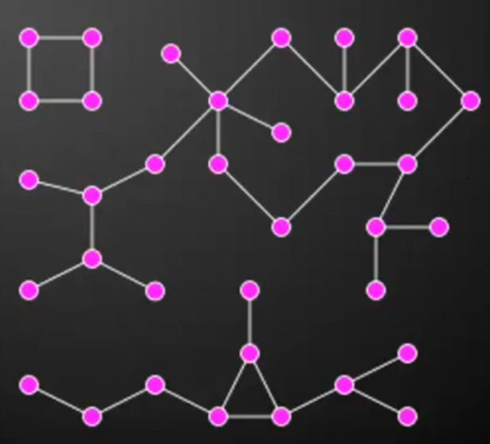

GRAPHS
==================================================
A graph is a set of nodes with connections between them.

#### Applications
* Computer Networks
* Social Networks
* Geographical Maps
* State Machines


* The connections are many-to-many.
* The nodes are called **vertices** (върхове).
    - Core elements of graphs.
    * Can have values, names, ids, etc.
* The connections are called **edges** (ребра).
    - They link the *nodes* of a graph together.
    - Can be **directed/undirected**.
        * 
        * 
    - Can be **weighted/unweighted**.
        
* Trees and lists are *specific cases* of graphs.
    * Trees are acyclic, undirected graphs.

### Paths
* A **path** in a graph is a sequence of nodes.
    - With *edges* between each pair in the sequence.
    - The *edges* pointing from left to right.
    - E.g. path `n1, n2, n3`, means there are *edges*:
        * n1 -> n2
        * n2 -> n3
* Cycle
    - A path in graph that ends, on it's starting node.
    - E.g. `A, B, C, A`
    - A non-cyclic path is known as **simple**.
* Graphs with no cycles are known as **acyclic**.
* A node `y` is *reachable* from node `x`, if there is *path*
    that starts with `x` and ends with `y`.
* A graph is *connected*, when every node is reachable from any other.
* A **component** of a *disconnected* graph is a sub-graph of vertices,
    that are connected.



Representations
-------------------------
* Lists
    - Nodes List
    - Edges List
* Adjacency Matrix
    - Nodes x Nodes
    - Memory intensive.
    - Efficient for connected graphs.
    - Efficient for graphs with plenty of duplicate edges.
    - Quick way to code a weighted graph.
* Adjacency List
    - Nodes to Nodes
* Object Oriented
    ```
        node = { key, neighbors }
    ```
* Object Oriented with Edges
    ```
        node = { key, edges }, edge = { source, destination, weight }
```


Algorithms
-------------------------

### Traversal
* Breadth-First Search
    * Complexity is O(V+E).
* Depth-First Search
    * Complexity is O(V+E).

### Shortest Paths Problem
* Performance doesn't depend on weight values.
* Breadth-First Search
    * For unweighted graphs.
* Dijkstra's Algorithm
    * For weighted graphs.
    * No negative weights.
    * Complexity is O(E+VlgV).
* DAG Dijkstra
    - DAGs
    - With positive & negative weights.
* Bellman-Ford Algorithm
    - Positive & negative weights.
    - With negative weight cycles.
* A\*

### Topological Sorting Problem
Order the vertices of a DAG, such that, for every
directed edge, the `source` comes before the `destination`.

- For Directed Acyclic Graphs (DAGs)
* Khan's Algorithm (Source Removal)
* Recursive DFS

Questions
-------------------------
* What are graphs?
* What are the applications of graphs?
* What types of graphs are there?
* What is a path in a graph?
* What are the ways of representing a graph in a computer?
* What are the graph traversal algorithms?
* What are the algorithms for solving the shortest paths problem?
* What are the algorithms for topologically sorting a DAG.
