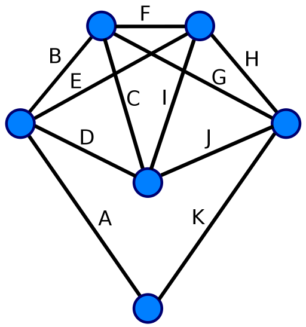

EULERIAN PATH
==================================================
* Visits every **edge** exactly once.
* **Can revisit** vertices.
* Eulerian *cycle/circuit* is a cyclic eulerian path.
* Eulerian graph is a graph with an *eulerian cycle*.
* Semi-Eulerian graph is a graph with an *eulerian path*.
* Applies to a connected graph, or a single graph component.
* The **degree** of a vertex, in an *undirected*,
    is the number of edges connected to it.
    - Directed graphs have an *indegree* and *outdegree*.
* For a graph to be *eulerian* all it's vertices must have
    an **even** degree.
* For a graph to be *semi-eulerian* *exactly two vertices* must
    have an odd degree.
* Directed graphs have an *eulerian cycle*, if and only if all
    nodes have the same *indegrees* and *outdegrees*.
* Directed graphs have an *eulerian path*, if and only if
    there is exactly one node with indegree = 1 + outdegree,
    and exactly one other node where outdegree = 1 + indegree.

Eulerian Cycle:
A -> B -> C -> D -> E -> F -> G -> H -> I -> J -> K

Finding Eulerian Cycles
-------------------------
#### Fleury's Algorithm
1. Start at an arbitrary vertex of an eulerian graph.
2. Repeatedly follow, and then delete, an edge from the current
    vertex, such that the graph isn't disconnected.
3. All edges would be traversed, and the traversal order will
    be an eulerian cycle.
* If that graph is *semi-eulerian* start at an odd degree vertex,
    to find an eulerian *path*.
* Slow in practice due to the time complexity of bridge finding.
* Time complexity is O(E^2)

#### Hierholzer's Algorithm
1. Start at an arbitrary vertex of an eulerian graph.
2. Traverse arbitrarily, until you're back at the source, forming a cycle.
3. Find a vertex X in the cycle connecting to a vertex not in the cycle.
4. Repeat 2 on X;
5. Combine all the cycles, by **inserting** later ones, into earlier ones.
* The cycle formed, by combining all the cycles, is an **eulerian cycle**.
* If that graph is *semi-eulerian* start at an odd degree vertex,
    to find an eulerian *path*.
* Time complexity is **O(E)**.

Questions
-------------------------
* What is an eulerian path/cycle?
* What is an eulerian graph/semi-graph?
* What is the degree of a vertex?
* What are the conditions under which a graph has an eulerian path/cycle?
* What is Fleury's Algorithm for finding eulerian cycles?
* What is it's time complexity?
* What is Hierholzer's Algorithm for finding eulerian cycles?
* What is it's time complexity?
