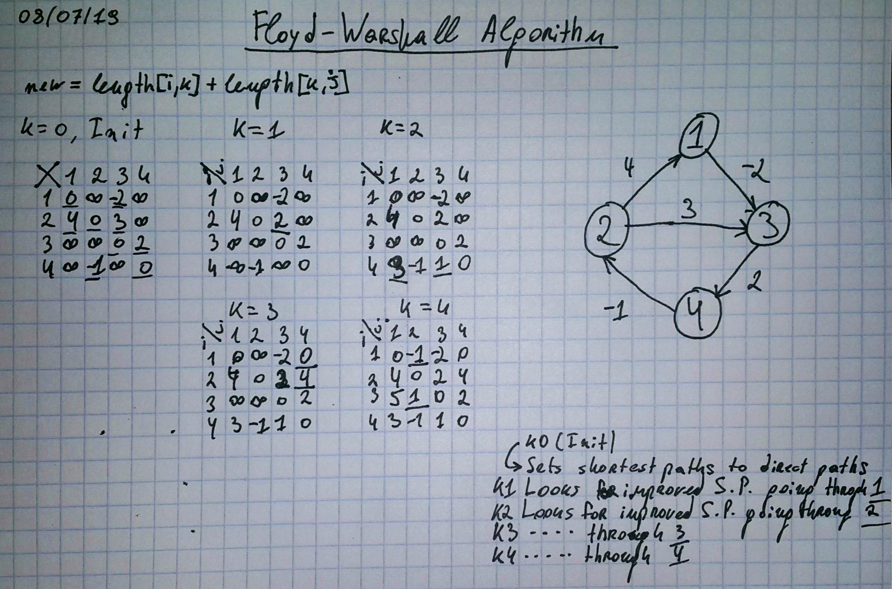

FLOYD-WARSHALL ALGORITHM (SHORTEST PATHS PROBLEM)
==================================================
1. For each vertex v set path[v, v] to 0.
2. For each edge (s, d, w) set path[s, d] to w.
3. For each vertex k, and each path[i, j], try to relax path[i, j] to 
    path[i, k] + path[k, j].
    - At each k step it tries to improve all paths going through k.
* Finds the shortest paths, between any 2 vertices in a graph.
* Uses dynamic programming.
* Time complexity is **O(V^3)**.
* Can detect *negative-weight-cycles*.
* Efficient for dense graphs.



### Pseudocode
```
1 let dist be a |V| × |V| array of minimum distances initialized to ∞ (infinity)
2 for each edge (u,v)
3    dist[u][v] ← w(u,v)  // the weight of the edge (u,v)
4 for each vertex v
5    dist[v][v] ← 0
6 for k from 1 to |V|
7    for i from 1 to |V|
8       for j from 1 to |V|
9          if dist[i][j] > dist[i][k] + dist[k][j] 
10             dist[i][j] ← dist[i][k] + dist[k][j]
11         end if
```
Questions
-------------------------
* What is the Floyd-Warshall algorithm?
* What is it's time complexity?
* When is it efficient to use it?
