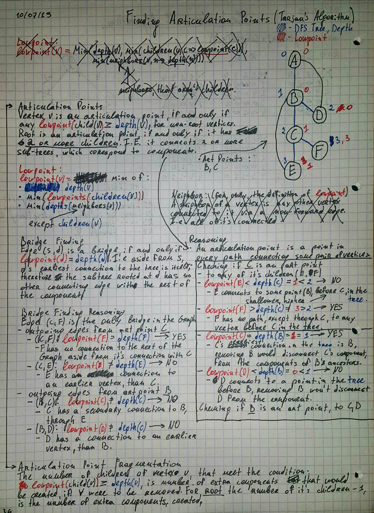

CONNECTIVITY
==================================================
* Articulation Point (AKA Cut Vertex)
    - A **vertex**, which if removed, would increase
        the number of components in the graph.
* Bridge
    - An **edge**, which if removed, would increase
        the number of components in the graph.
    - An edge is a bridge if and only if it is not contained in any cycle.
    - A graph with n vertices can contain, at most, n - 1 bridges.
* Bi-Connected Graph
    - A graph with no articulation point.
    - Removing any **one** vertex, won't fragment it.
* Removing an articulation point produces 2 bi-connected graphs.

Finding Articulation Points & Bridges
-------------------------
An articulation point is a point in **every** path,
    between some pair of vertices.

#### Naive Algorithm
Remove any one vertex/edge from the graph, and count the components,
via traversal. Repeat for all vertices/edges.

Complexity, for vertices, is **O(V^2+VE)**.
Complexity, for edges, is **O(E^2+VE)**.

#### Efficient Algorithm (Tarjan's Bridge Finding Algorithm)
Do a DFS noting the **depth** of every vertex in the DFS tree.
*After* all children of of a vertex have been explored, note the **lowpoint**
of the vertex. A non-root vertex is an articulation point, if and only if
it's **depth** is less than or equal to the **lowpoint** of any of it's children.
Root is an articulation point, if and only if if has 2 or more children,
i.e. it connects 2 or more sub-trees, which correspond to components.

The number of *extra* components created by removing a non-root
articulation point v, is the number of children of v,
where `depth(v) <= lowpoint(child(v))`.
For root the number of *extra* components is `children_count(root) - 1`.

```
lowpoint(v) = min
(
    depth(v),
    min(lowpoints(children(v))),
    min(depths(neighbors(v).where(n => !children(v).contains(n)))),
)
```

An edge (s, d) is a bridge, if and only if d's depth is the same as it's lowpoint,
i.e., aside from s, d's earliest connected vertex is itself.

Complexity is **O(V+E)**.



Questions
-------------------------
* When is graph connected?
* What is an articulation point in a graph?
* What is a bridge in a graph?
* When is a graph bi-connected?
* What is Tarjan's bridge finding algorithm?
* What is it's time complexity?
