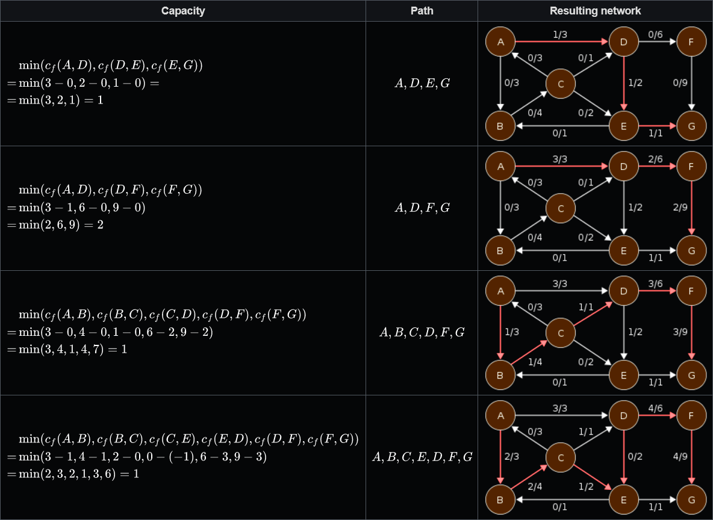

EDMONDS-KARP ALGORITHM (FINDING MAXIMUM FLOW)
==================================================
1. Find the shortest (edgewise) *augmenting path*, from *source* to **sink**.
    - An *augmenting path* is a path, where no edges are at max capacity.
    - Use BFS to find it.
2. Run as much flow through the path, as possible,
    and the same negative flow in the other direction.
    - This allows for returning flow later, in case of suboptimal path choices.
3. Repeat, until no augmenting path can be found.

* Time complexity is **O(V*E^2)**.
* The algorithm is a case of the **Ford-Fulkerson Method**.

QUESTIONS
-------------------------
* What is the Edmonds-Karp algorithm?
* What is it's time complexity?
